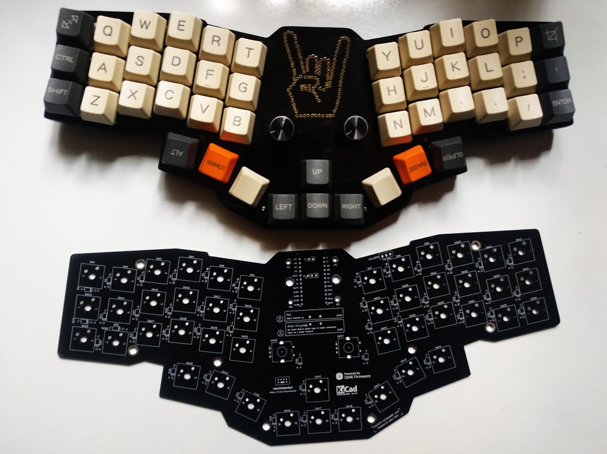

# Cockpit Keyboard

A hot swap system column staggered mechanical keyboard, running QMK Firmware on Pro Micro controllers. 

 

## Bill of Materials

| Qty  | Descript                                                               |
|------|------------------------------------------------------------------------|
| 1    | PCB board                                                              |
| 1    | Arduino Pro Micro                                                      |
| 1    | ProMicro socket 24 pin wide or 2.54 mm pitch female header             |
| 48   | Diode 1N4148 THT                                                       |
| 2    | EC11 Rotary Encoder                                                    |
| 2    | Encoder knob                                                           |
| 46   | MX Compatible Key Switch (3pin or 5pin)                                |
| 46   | MX Compatible Keycap (1U)                                              |
| 13   | M2 Spacer 5mm or 6mm (Standoff   )                                     |
| 26   | M2 Screw 5mm                                                           |
| 1    | [Top Plate (1.5mm aluminium or acrylic)](acrylic-plate/)               |
| 1    | [Upper Middle Plate (3mm acrylic)](acrylic-plate/)                     |
| 1    | [Lower Middle Plate (3mm acrylic)](acrylic-plate/)                     |
| 1    | [Bottom Plate (2mm or 3mm acrylic)](acrylic-plate/)                    |
| 1    | [Pro Micro Cover (2mm or 3mm acrylic)](acrylic-plate/)                 |
| 1    | 8 channel WS2812 5050 RGB LED                                          |
| 1    | Tact Switch 6X6 4mm                                                    |

## Schematic

## Firmware
[Frimware](Firmware)

### Turkey Mechanical Keyboard Community
[Telegram: mechistanbul](https://t.me/mechistanbul) 

 

<a href="https://pcbway.com" >PCBWay</a> graciously offered to sponsor the prototype build of this keyboard    
Thanks PCBWay

 

