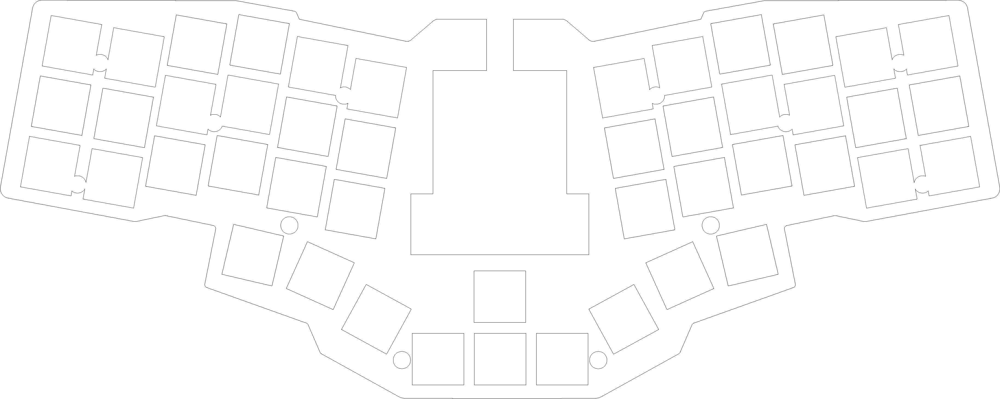
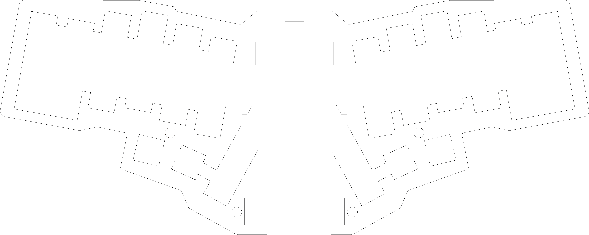
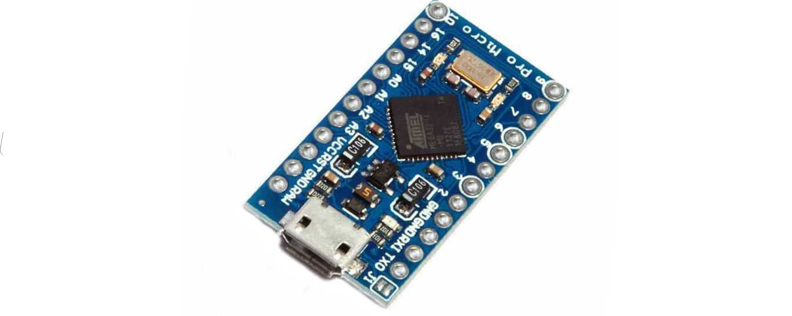
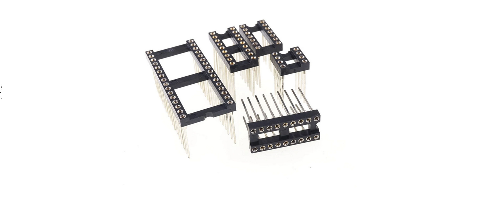
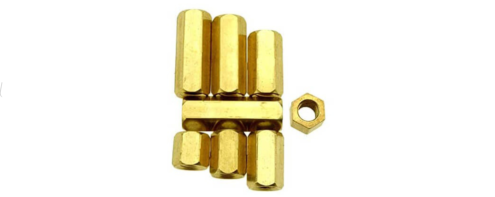
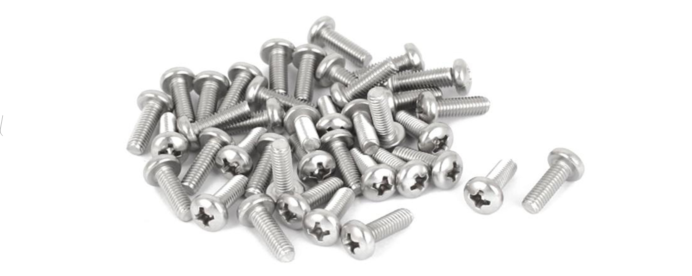
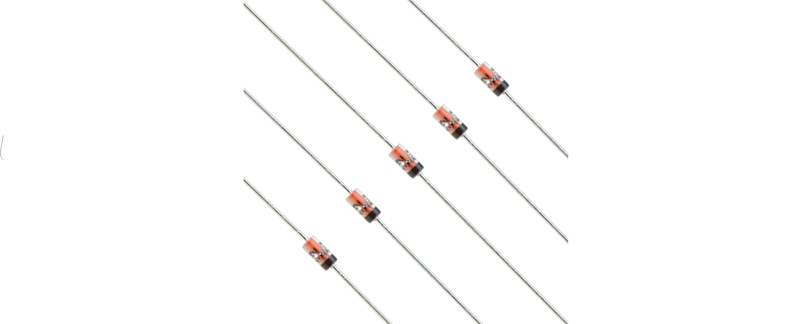
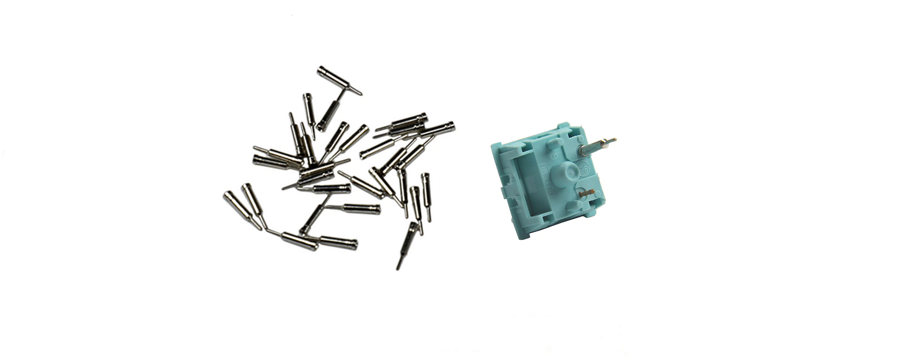
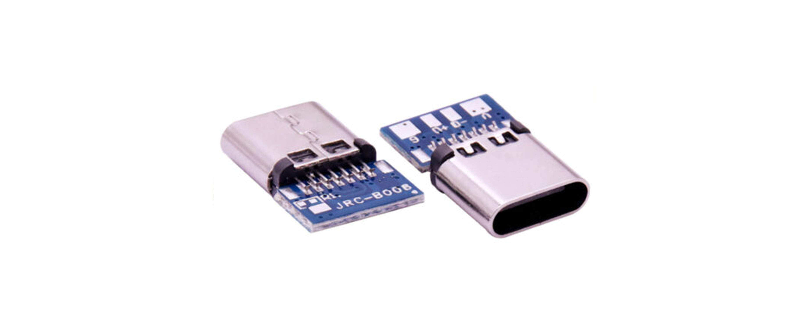
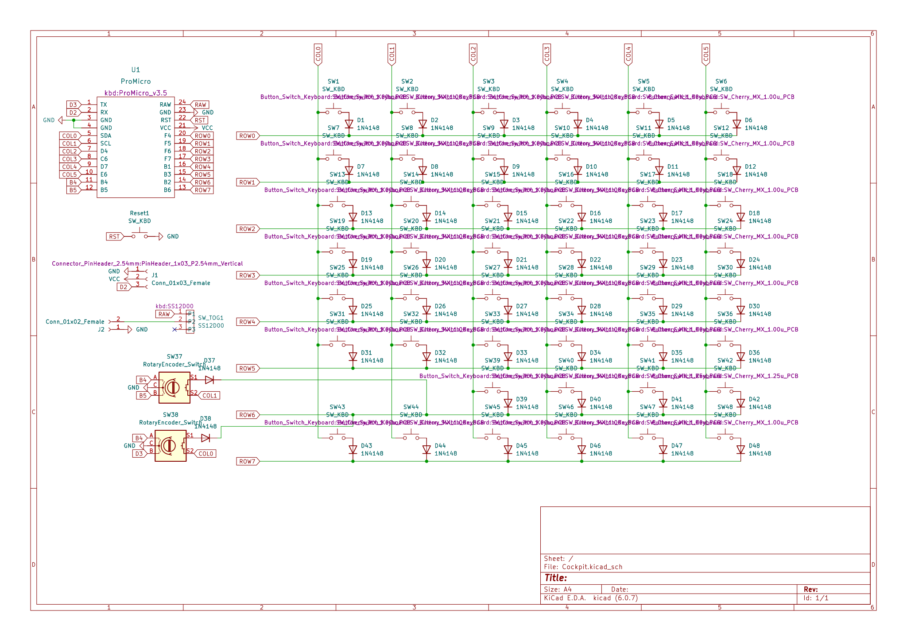

# Cockpit Keyboard

A hot swap system for Handwire builds column staggered mechanical keyboard, running QMK Firmware on Pro Micro controllers. 

                  
          
## Parts list 

|                                                     | Description                                                         | Qty  |
| :---                                                |    :----:                                                           | ---: |
|                     |[Top Plate (1.5mm aluminium or acrylic)](acrylic-plate/top-plate/)   | 1    |
|    |[Upper Middle Plate (3mm acrylic)](acrylic-plate/upper-middle-plate/)| 1    |
|           |[Riveting Plate (2mm acrylic)](acrylic-plate/riveting-plate/)        | 1    |
|    |[Lower Middle Plate (3mm acrylic)](acrylic-plate/lower-middle-plate/)| 1    |
|               |[Bottom Plate (2mm or 3mm acrylic)](acrylic-plate/bottom-plate/)     | 1    |
|      |Arduino Pro Micro                                                    | 1    |
|        |ProMicro Socket 24 Pin Wide (optional)                               | 1    |
|                          |M2 Spacer 5mm or 6mm                                                 | 12   |
|                        |M2 Screw 4mm                                                         | 24   |
|               |Diode 1N4148 THT                                                     | 48   |
|                            |Single Core 0.5mm Cable                                              | ~3m  |
|                     |Switch Rivet (Hot Swap Sip Socket Similar to Millmax) or 7305-0-15-15-47-27-10-0 millmax | 92   |
|               |EC11 Rotary Encoder                                                  | 2    |
|                      |Knob                                                                 | 2    |
|                          |Type C Connector 14 Pin Female                                       | 1    |
|          |Micro USB Male Type B 5 Terminal Jack Port Solder Connector          | 1    |
|                       |MX Compatible Key Switch (3pin or 5pin)                              | 46   |
|                        |MX Compatible Keycap (1U)                                            | 46   |

## Schematic

## Firmware
[Frimware](Firmware)

### Turkey Mechanical Keyboard Community
[Telegram: mechistanbul](https://t.me/mechistanbul)
