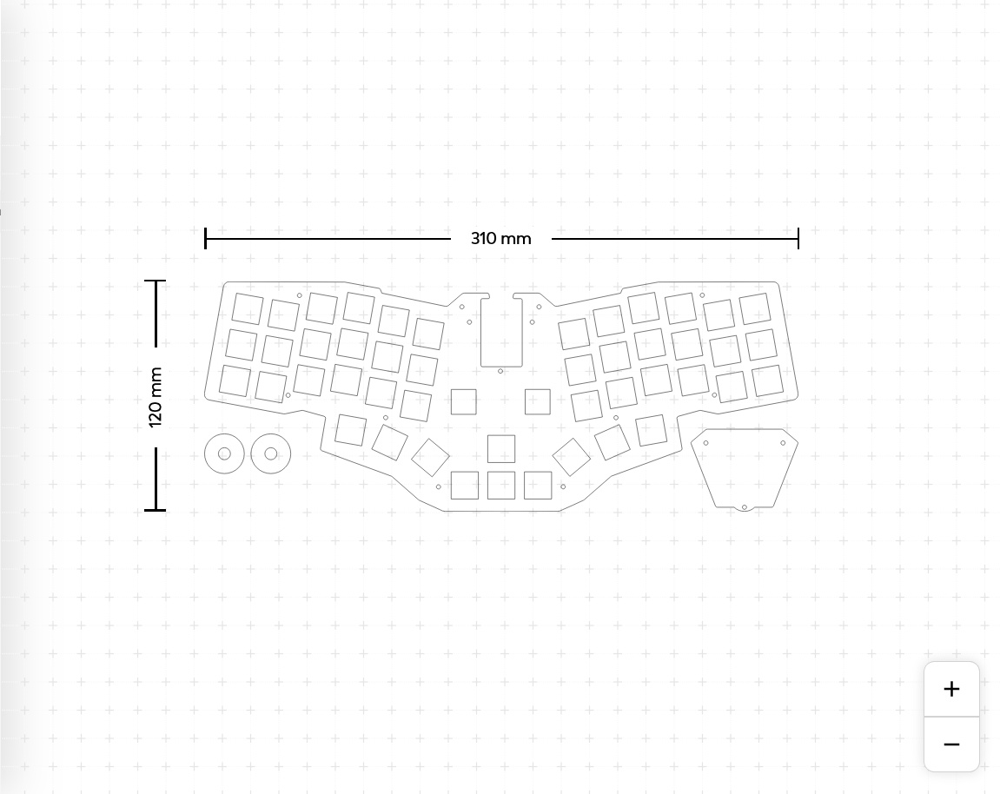
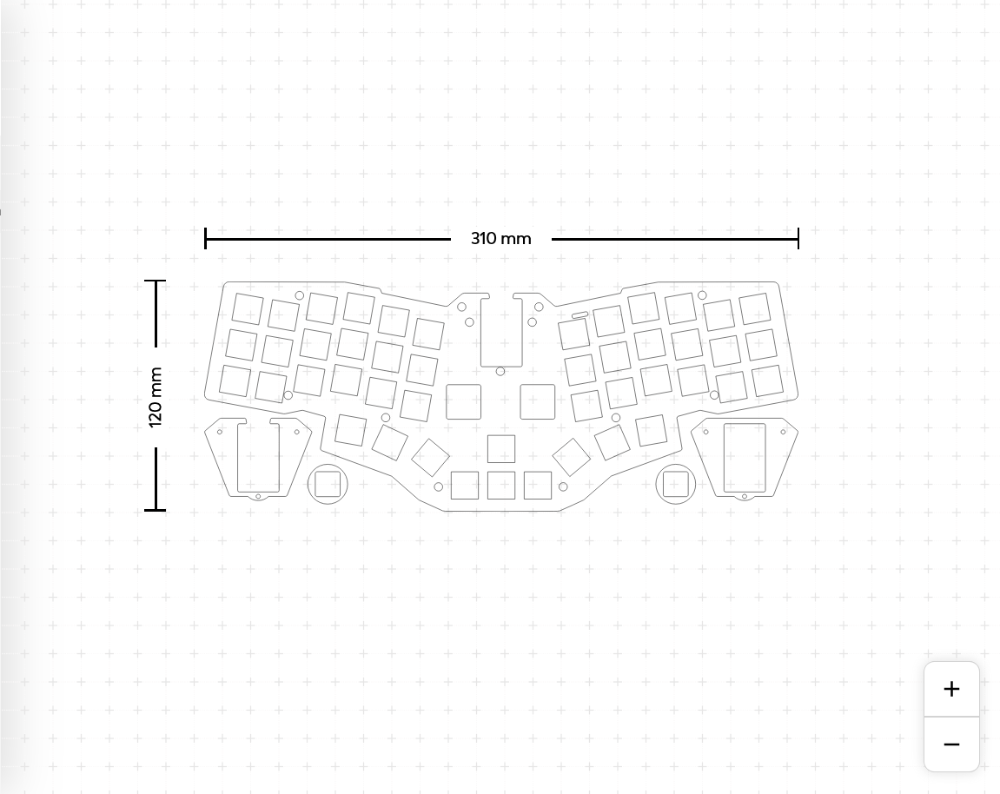
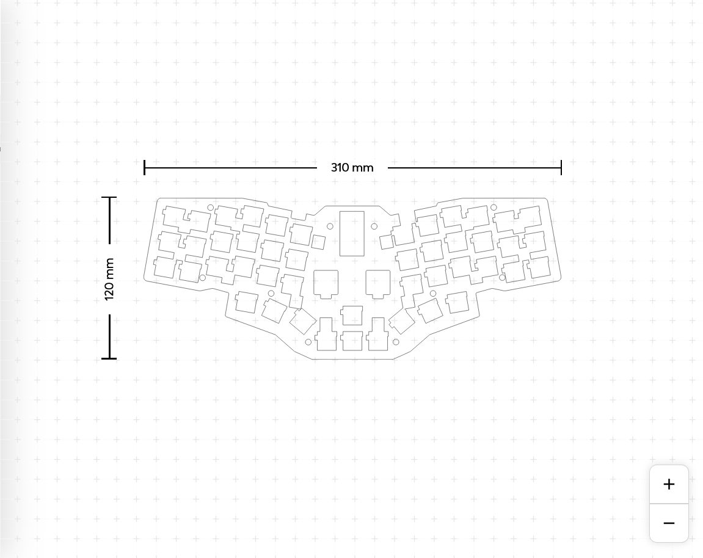
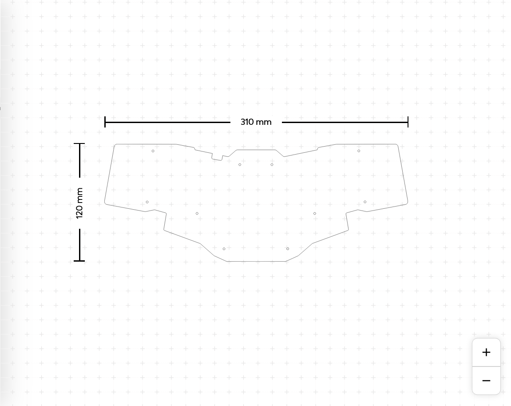

# Cockpit Keyboard

> [!WARNING]  
> This version (cockpit_hotswap) has not yet been tested. 

### Bill of Materials

| Qty  | Descript                                                               |
|------|------------------------------------------------------------------------|
| 1    | PCB board                                                              |
| 1    | Arduino Pro Micro                                                      |
| 1    | ProMicro socket 24 pin wide or 2.54 mm pitch female header             |
| 46   | Kaihl Hot-swap sockets                                                 |
| 48   | 1N4148 SOD123 Diodes                                                   |
| 14   | WS2812B RGB LED Chip, 5050 SMD                                         |
| 1    | Tact Switch RS-282G05A3                                                |
| 1    | 7-Pin On/Off 1P2T SPDT MSK-12C02 SMD Toggle Slide Switch               |
| 2    | EC11 Rotary Encoder                                                    |
| 2    | Encoder knob                                                           |
| 46   | MX Compatible Key Switch (3pin or 5pin)                                |
| 46   | MX Compatible Keycap (1U)                                              |
| 13   | M2 Spacer 7mm (Standoff)                                               |
| 26   | M2 Screw 5mm                                                           |
| 1    | [Top Plate (1.2mm aluminium or acrylic)](acrylic-plate/)               |
| 1    | [Upper Middle Plate (4mm acrylic)](acrylic-plate/)                     |
| 1    | [Lower Middle Plate (3mm acrylic)](acrylic-plate/)                     |
| 1    | [Bottom Plate (2mm or 3mm acrylic)](acrylic-plate/)                    |
| 1    | [Pro Micro Cover (2mm or 3mm acrylic)](acrylic-plate/)                 |

### PCB Renders 

|        |       |  
|:------:|:------:|
|    | |
|PCB top, full ground plane |PCB bottom, full ground plane|

### Case

|        |        |  
|:------:|:------:|
|     |  |
| | |

